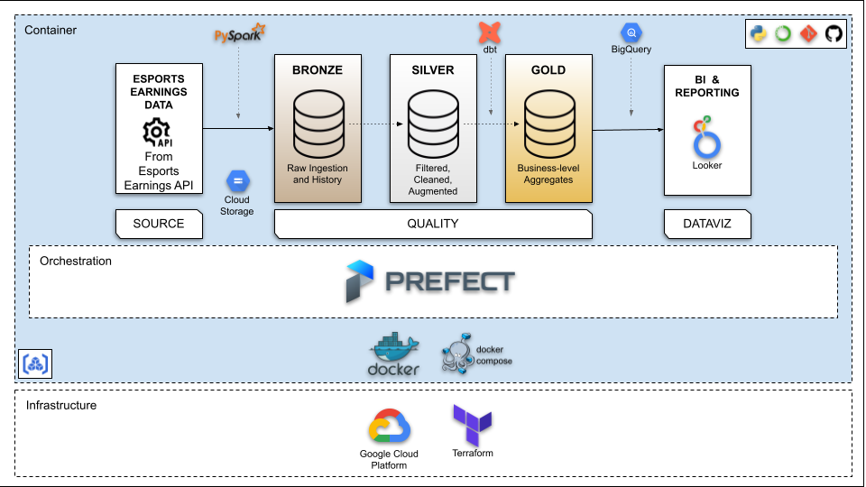
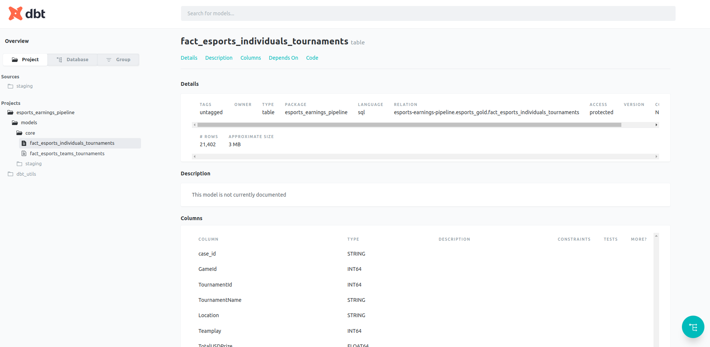
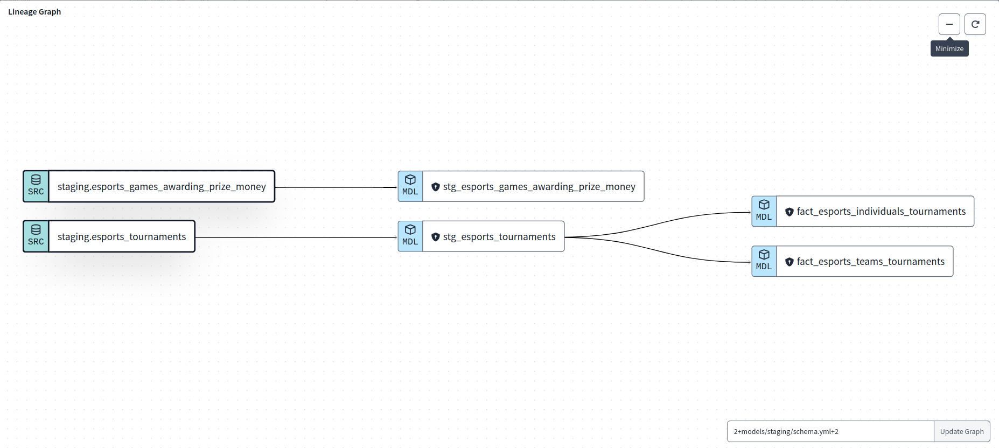
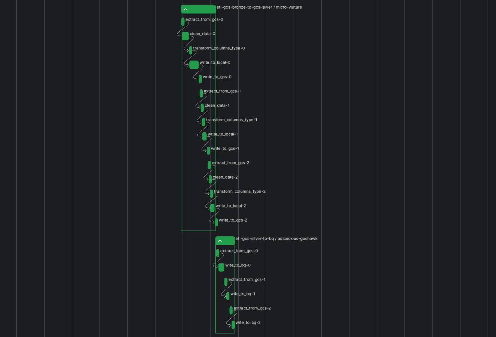
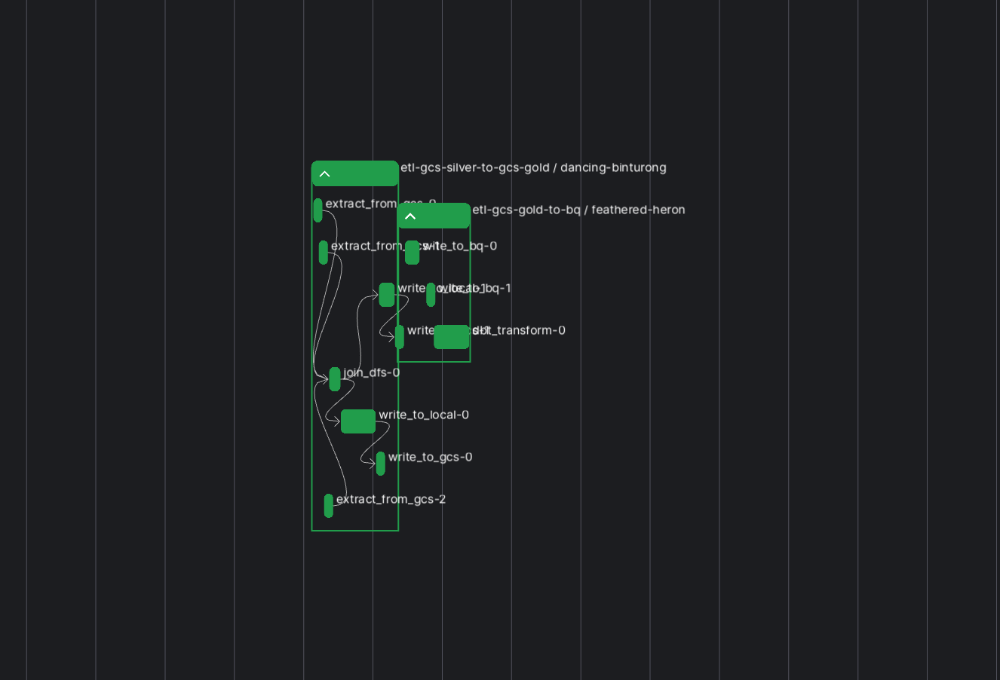
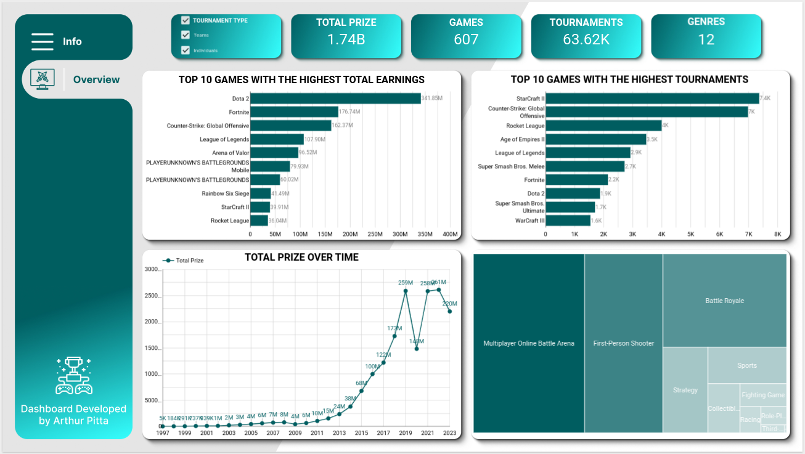

## Esports Earnings Data Pipeline - A Data Engineering Project
---
The goal of this project is to build an end-to-end batch data pipeline on Esports Earnings Data available at [Esports Earnings](https://www.esportsearnings.com/). In addition, perform ELT (Extract Load Transform) monthly in order to analyze the esports earnings patterns from historical data to till date.

### Table of contents

- [Problem statement](#problem-statement)
  - [Dataset](#dataset)
  - [Proposed Solution](#proposed-solution)
- [Data Pipeline Overview](#data-pipeline-overview)
- [Technologies](#technologies)
- [Architecture](#architecture)
- [ELT Steps](#elt-steps)
- [The Dashboard](#the-dashboard)
- [Reproduction](#reproduction)
- [Conclusion](#conclusion)
- [Future Work](#future-work)
- [References & Resources](#references--resources)

## Problem statement
---
* ### ***Data***: 
    The Data selected for this project is the `Esports Earnings` obtained from [Esports Earnings](https://www.esportsearnings.com/). This data includes esports earnings filed with the Esports Earnings community-driven competitive gaming resource based on freely available public information. The accuracy of this website is dependent on user contributions. Data since 1998. The Data is extracted via Esports Earnings API.

    The columns in the Datasets and their descriptions is available [here](docs/info_dataset.md)

* ### ***Proposed Solution***:
    This project aims at extracting this data from the source via API and building a BATCH ELT which will be scheduled to run monthly and update the connected Dashboard for monthly Analytics & Reporting. 

## Data Pipeline Overview 
---
This is a Batch Pipeline which will perform ELT on the 1st of every month at 07:00 am. 

The ELT steps include:

* **Extract** dataset from Esports Earnings via API and load the data into the Datalake
* **Clean** data and load the data into Datalake 
* **Load** the data from Datalake into external tables in the Datawarehouse
* **Transform** the data in the Datawarehouse
* **Visualize** the data by creating a Dashboard

## Data Pipeline with Medallion Architecture
---
* Bronze layer (raw data): parquet format
* Silver layer (cleansed and conformed data): delta format
* Gold layer (curated business-level tables): delta format

## Technologies 
---
* Cloud: ***GCP***
* Infrastructure as code (IaC): ***Terraform***
* Workflow orchestration: ***Prefect***
* Containerization: ***Docker***
* Data Warehouse: ***BigQuery***
* Batch processing: ***PySpark***
* Data Transformation: ***dbt-core***
* DataViz: ***Looker Studio***
* Virtual Environment: ***Anaconda***
* CICD: ***Git***

## Architecture
---
Pipeline

## ELT Steps

Steps in the ELT are as follows:

1. A Project is created on ***GCP*** 
2. Esports Earnings API key is obtained by creating an account on [Esports Earnings](https://www.esportsearnings.com/dev), which will be used to extract the data from the source.
3. Infrastructure for the Project is created using ***Terraform*** which creates the following:
    * Datalake: ***Google Cloud Storage Bucket*** where the raw and cleaned data will be stored
    * Data Warehouse: Three Datasets on ***BigQuery*** namely `esports_bronze`, `esports_silver` and `esports_gold` are created in order to store the tables/views during different stages of ELT
    * Artifact Registry: A place to manage the container (Docker) images 
4. ***Prefect Cloud API*** is obtained by creating an account on Prefect Cloud
5. The Pipeline for ELT is created on the Docker Image and is scheduled for monthly execution. It is orchestrated via ***Prefect Cloud***; which does the following tasks
    * Extracts raw data from source via ***Esports Earnings Data API***
    * Loads raw data as parquet files to GCS Bucket
    * Cleans the raw data using ***PySpark***
    * Loads the cleaned data as delta files to GCS
    * Creates External table in the Datasets in BigQuery by pulling data from GCS. 
    * Transforms Data from BigQuery using ***dbt-core*** and creates the following in the dev/prod Dataset (along with Tests and Documentation)
        - The views `stg_esports_tournaments` and `stg_esports_games_awarding_prize_money`
        - Fact tables `fact_esports_teams_tournaments` and `fact_esports_individuals_tournaments`

    * DOCUMENTATION ON DBT-CLOUD: 

    * LINEAGE GRAPH ON DBT-CLOUD:

    * ELT PIPELINE VISUALIZATION  ON PREFECT CLOUD 

6. Transformed Data from BigQuery is used for Reporting and Visualization using Looker Studio to produce Dashboards

## The Dashboard: 
---
The dashboard is accessible from [here](https://lookerstudio.google.com/s/tGQaUxF6-9U)

## Reproduction:
---
You can recreate and run the project by following the step by step instructions [here](docs/ProjectReplication.md)

## Conclusion
---
Through this project we were able to successfully build a ELT pipeline end to end which is scheduled to run monthly. And as a result we have a monthly updated Esports Earnings which can be visualized via the Dashboard on Looker Studio. This helps us get some useful insights on the latest esports trends and patterns.

## Future Work
---
- Combine data about neighbourhoods and districts from other sources and make the reporting more rich.
- Use DataProc to perform Spark job
- Create a normalized data structure when using more data sources
- Setup GCP Service Account and Permissions via Terraform

[Back To Top](#esports-earnings-data-pipeline-a-data-engineering-project)