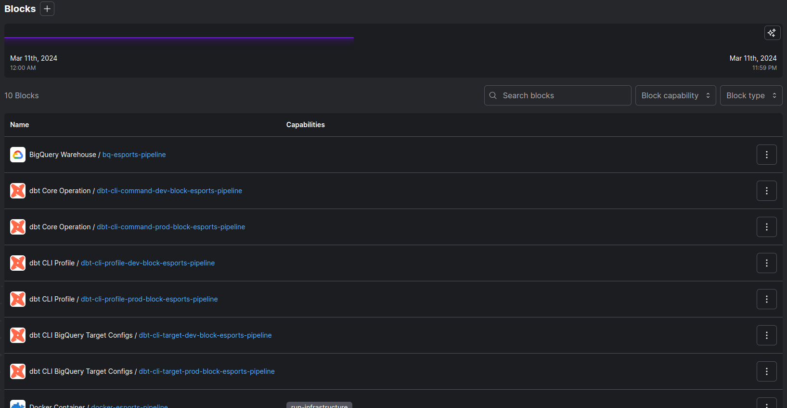
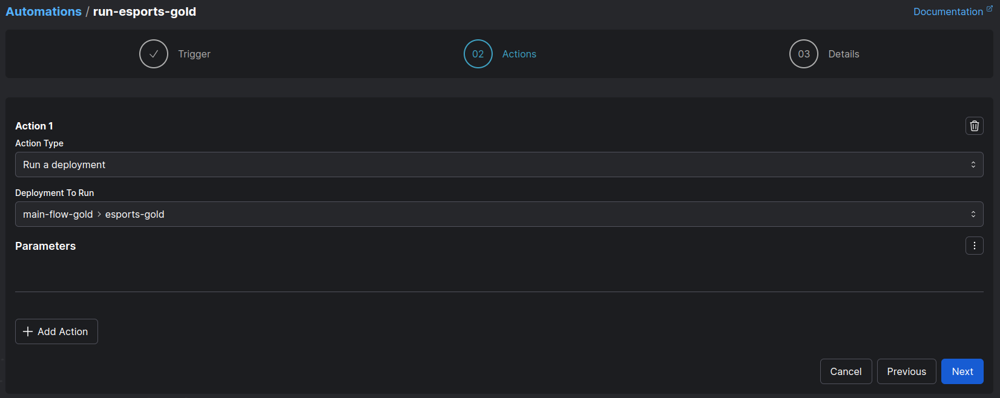

# Project Replication
---                                         
## Execute the below on your LOCAL MACHINE

### ***REQUIREMENTS*** - Local Machine
---
### ***INITIAL SETUP***

1. Clone the project on your local machine
    ```bash
        git clone https://github.com/DevPitta/esports-earnings-pipeline.git
        cd esports-earnings-pipeline
    ```
2. Install Docker and Docker Compose
    * Set up Docker's apt repository
    ```bash
        # Add Docker's official GPG key:
        sudo apt-get update
        sudo apt-get install ca-certificates curl
        sudo install -m 0755 -d /etc/apt/keyrings
        sudo curl -fsSL https://download.docker.com/linux/ubuntu/gpg -o /etc/apt/keyrings/docker.asc
        sudo chmod a+r /etc/apt/keyrings/docker.asc

        # Add the repository to Apt sources:
        echo \
        "deb [arch=$(dpkg --print-architecture) signed-by=/etc/apt/keyrings/docker.asc] https://download.docker.com/linux/ubuntu \
        $(. /etc/os-release && echo "$VERSION_CODENAME") stable" | \
        sudo tee /etc/apt/sources.list.d/docker.list > /dev/null
        sudo apt-get update
    ```
    * Install the Docker packages
    ```bash
        sudo apt-get install docker-ce docker-ce-cli containerd.io docker-buildx-plugin docker-compose-plugin
    ```
    * Verify that the Docker Engine installation is successful by running the hello-world image.
    ```bash
        sudo docker run hello-world
    ```
    
3. Install Anaconda
    * Visit [Anaconda](https://www.anaconda.com/download/)
    * Select Linux
    * Copy the bash (.sh file) installer link
    * Update your system
        ```bash
            sudo apt-get update
        ```
    * Move to the /temp directory
        ```bash
            cd /tmp
        ```
    * Use wget to download the bash installer
        ```bash
            wget installer link
        ```
    * Verify the hash code integrity of the package
        ```bash
            sha256sum anaconda.sh file
        ```
    * Run the bash script to install Anaconda3
        ```bash
            bash anaconda.sh file
        ```
    * source the .bash-rc file to add Anaconda to your PATH
        ```bash
            cd ~
            source .bashrc
        ```
        
4. Create a new environment
    ```bash
        conda create --name esports-pipeline python=3.10
        source .bashrc
    ```
    
5. Activate the new environment
    ```bash
        conda activate esports-pipeline
    ```
    
6. Install requirements in the new environment
    ```bash
        pip install -r requirements.txt
    ```
    
### ***ENV VARIABLES SETUP***

1. Rename `env_boilerplate` file to .env and change the default values as necessary

2. Rename `terraform_tfvars_boilerplate` file to terraform.tfvars and change the default values as necessary

### GCP Setup

For this project, we'll use a free version (up to $300 credits). 

1. Create an account with your Google email ID 
2. Setup your first [project](https://console.cloud.google.com/) if you haven't already
    * eg. "esports-earnings-pipeline", and note down the "Project ID" (we'll use this later)
3. Setup [service account & authentication](https://cloud.google.com/docs/authentication/getting-started) for this project
    * Grant `Viewer` role to begin with.
    * Download service-account-keys (.json) for auth.
4. Download [SDK](https://cloud.google.com/sdk/docs/quickstart) for local setup
5. Set environment variable to point to your downloaded GCP keys:
   ```shell
   export GOOGLE_APPLICATION_CREDENTIALS="<path/to/your/service-account-authkeys>.json"
   
   # Refresh token/session, and verify authentication
   gcloud auth application-default login
   ``` 
6. [IAM Roles](https://cloud.google.com/storage/docs/access-control/iam-roles) for Service account:
   * Go to the *IAM* section of *IAM & Admin* https://console.cloud.google.com/iam-admin/iam
   * Click the *Edit principal* icon for your service account.
   * Add these roles in addition to *Viewer* : **Storage Admin** + **Storage Object Admin** + **BigQuery Admin** + **BigQuery Admin** + **Cloud Run Admin**, **Artifact Registry Administrator**
   
7. Enable these APIs for your project:
   * https://console.cloud.google.com/apis/library/iam.googleapis.com
   * https://console.cloud.google.com/apis/library/iamcredentials.googleapis.com
   
8. Please ensure `GOOGLE_APPLICATION_CREDENTIALS` env-var is set.
   ```shell
   export GOOGLE_APPLICATION_CREDENTIALS="<path/to/your/service-account-authkeys>.json"
   ```

### ***TERRAFORM SETUP***
---

1. Download Terraform from [here](https://developer.hashicorp.com/terraform/downloads)

2. Install Terraform
    ```bash
        wget -O- https://apt.releases.hashicorp.com/gpg | sudo gpg --dearmor -o /usr/share/keyrings/hashicorp-archive-keyring.gpg
        
        echo "deb [signed-by=/usr/share/keyrings/hashicorp-archive-keyring.gpg] https://apt.releases.hashicorp.com $(lsb_release -cs) main" | sudo tee /etc/apt/sources.list.d/hashicorp.list
        
        sudo apt update && sudo apt install terraform
    ```

3. **Build the Project Infrastructure** via Terraform as follows 
    ```bash
        # run terrafrom from esports-earnings-pipeline/terraform directory
        docker-compose run terraform init
        # Initializes & configures the backend, installs plugins/providers, & checks out an existing configuration from a version control 
        docker-compose run terraform plan
        # Matches/previews local changes against a remote state, and proposes an Execution Plan.
        docker-compose run terraform apply
        # Asks for approval to the proposed plan, and applies changes to cloud
    ```

### ***UPLOADING DOCKER IMAGE TO ARTIFACT REGISTRY***

1. Configure authentication
    ```bash
        gcloud auth configure-docker us-central1-docker.pkg.dev
    ```

2. Build Docker Image
    ```bash
        docker image build -t esports-prefect .
    ```

3. Tag Docker Image
    ```bash
        docker image tag esports-prefect \
        us-central1-docker.pkg.dev/esports-earnings-prefect/quickstart-docker-repo/esports-prefect
    ```

4. Push Docker Image to Artifact Registry
    ```bash
        docker image push us-central1-docker.pkg.dev/esports-earnings-prefect/quickstart-docker-repo/esports-prefect
    ```

### ***API REQUIREMENTS***
---
* Esports Earnings API Key:
    - `API_KEY` is needed for extracting Esports Earnings data for this project. Find the instructions [here](info_api.md#instructions-to-get-your-esports-earnings-api-key) to get your key.
* PREFECT CLOUD API:
    - Get your Prefect API Key by following instructions [here](info_api.md#instructions-to-get-your-prefect-cloud-api) 
* Add the keys to the .env file


### ***SCHEDULING & RUNNING THE INGESTION PIPELINE***
---
1. Log into Prefect Cloud
    ```bash
        set -o allexport && source .env && set +o allexport
        prefect cloud login -k $PREFECT_CLOUD_API
    ```
    **Now you can use the Prefect cloud to register blocks and run your flows**

2. Create Prefect Blocks & Deploy via code. You can view the execution of the below code in your Prefect Cloud account, it takes some minutes to finish
    ```bash
        # Run the create_prefect_blocks.py and register the block
        prefect block register --file blocks/prefect_blocks.py
        # Deploy the all flows
        python create_main_deployments.py
        # Start the agent
        prefect agent start -q "default"
        # OPTIONAL - Force run the deployment for testing or ignore the below if you want to run it on schedule
        python run_main_deployments.py
        # Once the ELT is complete you can stop the prefect agent
        prefect cloud logout
    ```

3. Go to [Prefect Website](https://www.prefect.io/cloud) and Login

4. Edit dbt Core Operation blocks (dev & prod)

    * Change Project Dir to /opt/prefect/dbt
    * Change Working Directory to /opt/prefect/dbt

5. Create a new Work Pool named esports-pipeline

    * Create a Work Pool with the following configs:
        * Type: Cloud Run V2:push
        * CPU: 2000m
        * Image Name: us-central1-docker.pkg.dev/esports-earnings-pipeline/esports-earnings-repo/esports-prefect
        * Memory: 8Gi
        * Region: us-central1
        * GCP Credentials: select your GCP Credentials block
        * Max Retries: 3
    * After created change the Work Queue name from `default` to `esports`

6. Edit Deployments

    * Edit all the deployments and change the Work Pool and Work Queue from default-agent-pool and default to esports-pipeline and esports respectively
    * Schedule the esports-bronze deployment 


7. Create Automations

    * run-esports-silver


    * run-esports-gold



### ***FINAL STATE***
1. Now there should be 
    1. raw and clean data on GCS 
    2. tables `esports_tournaments`, `esports_games_awarding_prize_money` & `esports_games_genre` in the dataset `esports_bronze` on BQ.
    3. tables `esports_tournaments`, `esports_games_awarding_prize_money` & `esports_games_genre` in the dataset `esports_silver` on BQ.
    4. tables `esports_tournaments` &`esports_games_awarding_prize_money` in the dataset `esports_gold` on BQ.
    5. transformed data in `stg_esports_tournaments` and `stg_esports_games_awarding_prize_money` view & `fact_esports_teams_tournaments` and `fact_esports_individuals_tournaments` table in the `esports_gold`/`esports_dbt` dataset (follow instructions for esports_gold dataset)

### ***DESTROY THE INFRASTRUCTURE ON GCP***
---
**On your local machine** in the project folder `esports-earnings-pipeline/terraform` destroy the GCP infrastructure as follows

***NOTE: To delete the Datasets in BQ the tables or views need to be deleted***

```bash
    docker-compose run terraform destroy
```
